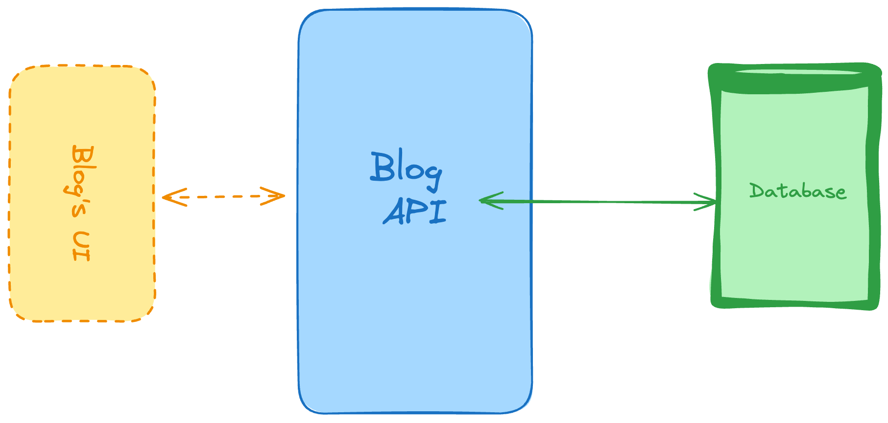

## Arquitectura del Sistema

  

**Esta API de Blog sigue una arquitectura clara de 3 capas:**

  1. **Blog's UI (Interfaz de Usuario(en proceso))**:
      
       - Frontend que consume nuestra API RESTful
       - Desarrollado con ReactJS
       - Se comunica exclusivamente con la capa de la API

  3. **Blog API (Capa de Servicio)**:
     
     - Desarrollada con FastAPI (Python)
        Proporciona endpoints RESTful para:
       - Gestión de usuarios (registro, autenticación, perfiles)
       - CRUD de artículos del blog
       - Comentarios y valoraciones
       - Búsqueda y filtrado
     - Valida datos y gestiona la lógica de negocio
     - Se comunica con la base de datos

  4. **Database (Almacenamiento)**:
     
      - Base de datos PostgreSQL
      - Almacena:
       - Usuarios y credenciales
       - Artículos del blog con su contenido
      - Comentarios y relaciones
      - Garantiza persistencia y consistencia de datos

### Flujo típico:
 1. - El usuario realiza una acción en la UI  
 2. - La UI hace una petición HTTP a la API  
 3. - La API procesa la petición, interactúa con la DB si es necesario  
 4. - La API devuelve una respuesta JSON a la UI  
 5. - La UI actualiza su estado según la respuesta  

